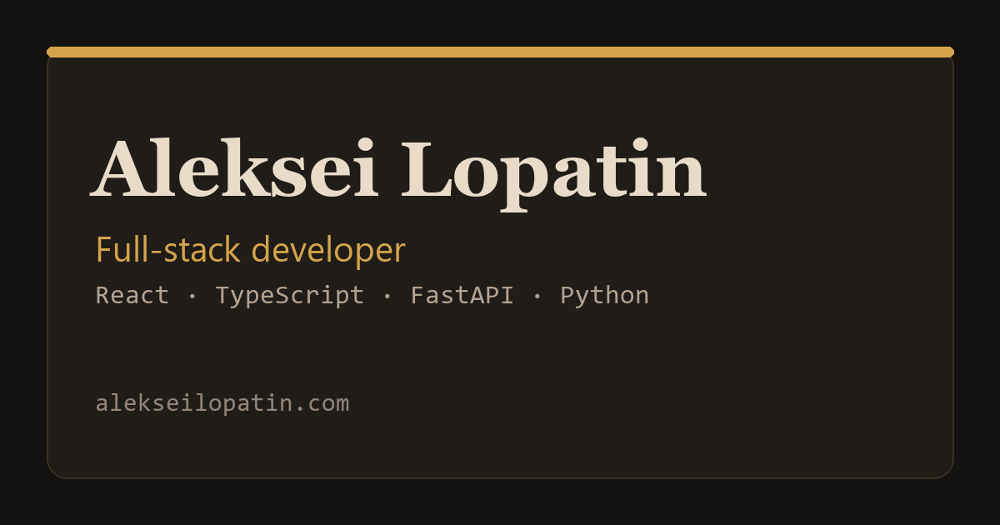
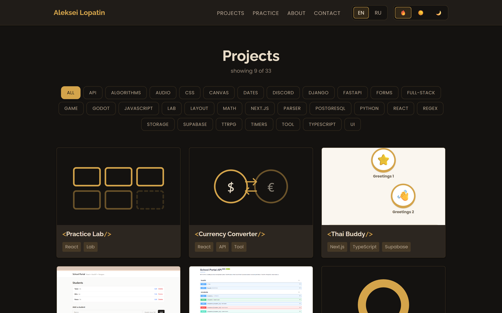
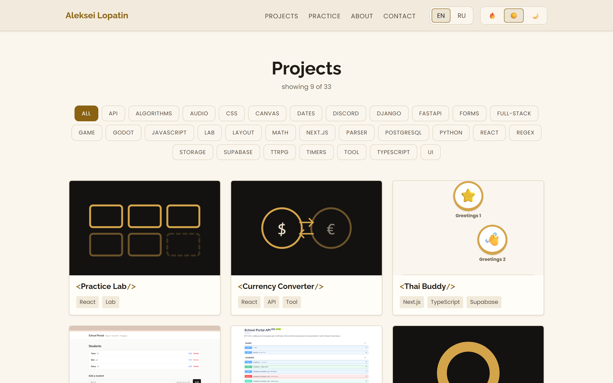
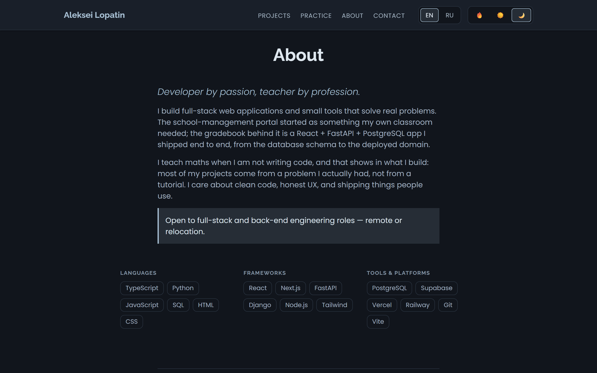
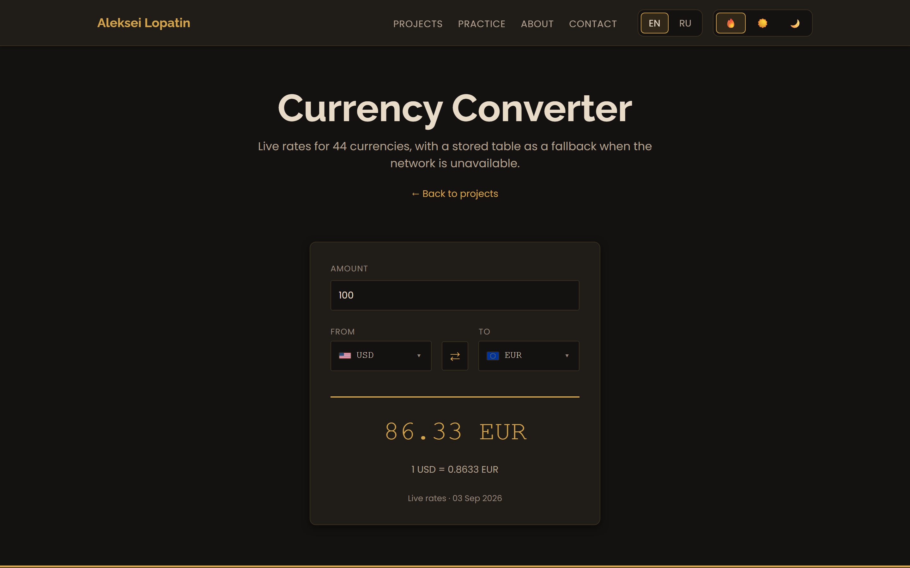
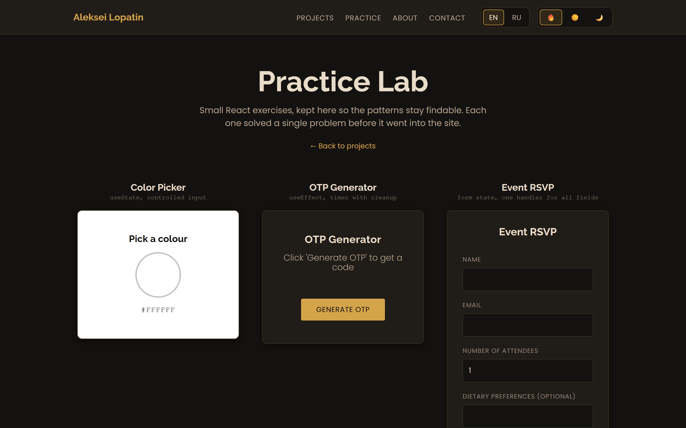
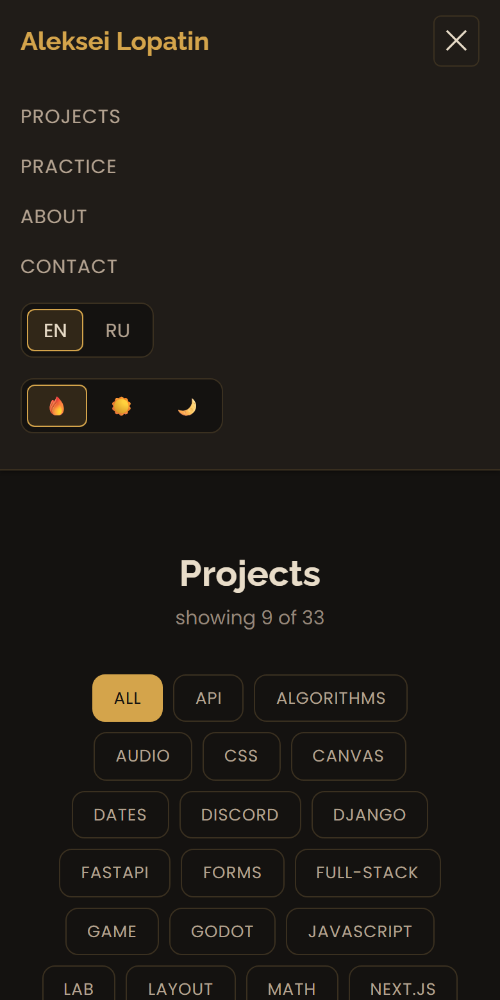

<div align="center">



# alekseilopatin.com

**Personal site and project index, rebuilt from a vanilla HTML/CSS/JS site into a React application.**

[Live site](https://alekseilopatin.com) · [Practice lab](https://alekseilopatin.com/practice) · [Currency converter](https://alekseilopatin.com/currency) · [Site v1 (archived)](https://legacy.alekseilopatin.com)


</div>

---

## What this is

The previous version of this site was ~500 lines of hand-written CSS and a pile of static HTML pages. This is the rebuild: same brand, same content, but as a real React application with routing, three themes, two languages and a test suite.

It also doubles as a place to put small React exercises where they stay findable, and hosts one tool I actually use — a currency converter running on live rates.

## Screenshots

<div align="center">

|  |  |
|---|---|
| **Ember** — the default dark theme | **Daylight** — light |
|  |  |
| **Twilight** — cool, colourblind-safe | **Currency converter** — live rates, search, flags |
|  |  |
| **Practice lab** — the small exercises | **Mobile** — collapsed navigation |
|  |  |

</div>

Screenshots are generated, not hand-taken: `npm run screenshots` builds the site, serves it and drives Playwright over every theme and viewport, so they cannot silently go stale.

## Features

**Three themes.** Ember (dark, default), Daylight (light) and Twilight (cool blue-grey). Every colour is a CSS custom property in [`tokens.css`](src/styles/tokens.css); themes swap only the colour tokens, never the spacing or type scale. The choice persists in `localStorage` and is applied by an inline script in `index.html` *before* React mounts, so there is no flash of the wrong theme on reload.

**Two languages.** English and Russian, with no i18n library — a context, a flat dictionary and a `t()` function ([`i18n/`](src/i18n)). Falls back to the browser language on a first visit, and a missing key renders as the key itself so gaps are visible rather than silent. A test asserts both dictionaries have identical keys and identical `{placeholders}`.

**Project index.** 33 projects from one data file, filtered by tags that are derived from the data rather than hand-maintained. Internal entries render as router links, external ones as `target="_blank"` with `rel="noopener"`.

**Currency converter.** 44 currencies on live rates, searchable by code or name, with country flags, a swap button, and a stored rate table it falls back to when the network is unavailable.

**Practice lab.** Four small components — colour picker, OTP generator with a countdown, RSVP form, mood board — each solving one problem before that pattern went into the site proper.

## Engineering notes

The decisions worth explaining, and why they went this way:

**Contrast was measured, not eyeballed.** Every text/background pair in all three themes was checked against WCAG AA in the browser. Two real bugs came out of it: `success` and `error` in the Twilight theme had *identical* luminance (contrast ratio 1.0 — indistinguishable in greyscale), and the theme switcher buttons inherited the browser's default `buttontext` black, giving 1.12:1 on the dark themes. Both are fixed; the minimum across all themes is now 4.8:1.

**Twilight is colourblind-safe by construction.** Its whole palette sits on one blue–yellow axis with no red/green pair anywhere, so deuteranopia and protanopia leave it intact. Success and error are blue and amber — the one pairing that survives all three types of colour blindness — and they differ in lightness as well as hue.

**The converter memoises across the whole rate table, not one pair.** `useMemo` computes the amount in *every* currency keyed on `[amount, from, rates]`; changing the target currency reads a value out of that object instead of recomputing. This was originally a constraint from the exercise the component grew out of, and it turned out to be the right shape once a multi-currency view became plausible.

**A custom combobox instead of `<select>`.** A native select cannot contain a search field. The replacement ([`CurrencySelect.jsx`](src/components/CurrencySelect.jsx)) keeps listbox/option roles, `aria-selected`, focus management, Escape-to-close and click-outside-to-close, and memoises the filter so typing does not re-scan the list on unrelated re-renders.

**Flags are local PNGs, not emoji.** Chrome on Windows does not render regional-indicator flag emoji and degrades them to letter pairs (`US`, `EU`). 44 flags at 40px cost 52 KB total and also keep working offline, which matters for a converter that advertises an offline fallback.

**`localStorage` is always wrapped.** It throws `SecurityError` outright when site data is blocked, and an unguarded read in a context provider takes the entire app down to a white screen. There is a test for this.

**Page titles are set imperatively.** React 19 can hoist `<title>` and `<meta>` out of a component, but it does not remove the matching tags from `index.html`, so the document ends up with two of each. The static tags have to stay — social crawlers do not execute JS — so [`PageMeta`](src/components/PageMeta.jsx) rewrites the existing tags instead of adding new ones.

**Accessibility is not an afterthought.** Skip link, visible `:focus-visible` rings, `aria-live` on the OTP countdown, `aria-pressed` on every toggle, labelled form controls, and `prefers-reduced-motion` honoured for every transition and animation.

## Tech

| | |
|---|---|
| **Framework** | React 19 |
| **Build** | Vite 8 |
| **Routing** | React Router 7 |
| **Styling** | Plain CSS with custom properties — no framework |
| **State** | `useState` / `useMemo` / Context — no external store |
| **Tests** | Vitest + React Testing Library + jsdom |
| **Data** | [open.er-api.com](https://open.er-api.com) for exchange rates |
| **Hosting** | Vercel |

No CSS framework and no state library — at this size both would add more concepts than they remove.

## Structure

```
src/
├── components/     UI components, each with its own CSS file
├── pages/          One component per route
├── data/           projects.js, currencies.js — content, not markup
├── i18n/           Language context + en/ru dictionary
├── theme/          Theme context (ember | daylight | twilight)
├── styles/         tokens.css — the single source of truth for design
└── test/           Test setup and provider helpers
```

Content lives in `data/`, never in JSX: adding a project or a lab is one object in one file, and the tag filter, counters and navigation pick it up on their own.

## Running it

```bash
npm install
npm run dev
```

| Command | |
|---|---|
| `npm run dev` | Dev server on :5173 |
| `npm run build` | Production build to `dist/` |
| `npm run preview` | Serve the production build locally |
| `npm test` | Run the suite once |
| `npm run test:watch` | Watch mode |
| `npm run coverage` | Coverage report |
| `npm run lint` | Oxlint |
| `npm run screenshots` | Regenerate the README screenshots with Playwright |

**Note for Windows:** the test config pins `pool: 'threads'`. Vitest's default `forks` pool fails to start workers when the project path contains a space.

## Tests

53 tests, 93% statement coverage. They exercise behaviour through accessible roles rather than class names, so restyling does not break them.

Covered: tag filtering and pagination, routing including the 404 route, the converter against a mocked API (live rates, network failure, and a `200` response carrying `result: "error"`), the searchable combobox, the OTP countdown under fake timers, theme and language persistence, and clipboard copying with its failure path. Data itself is tested too — dictionary parity between languages, unique project ids, and no links left pointing at the old domain.

## The archived site

Version 1 lives on at [legacy.alekseilopatin.com](https://legacy.alekseilopatin.com) — hand-written HTML, CSS and JavaScript, no build step. The 22 older projects listed here still run there, and this site links to them at that domain.

## License

Code is MIT. The written content, images and CV material are not.
